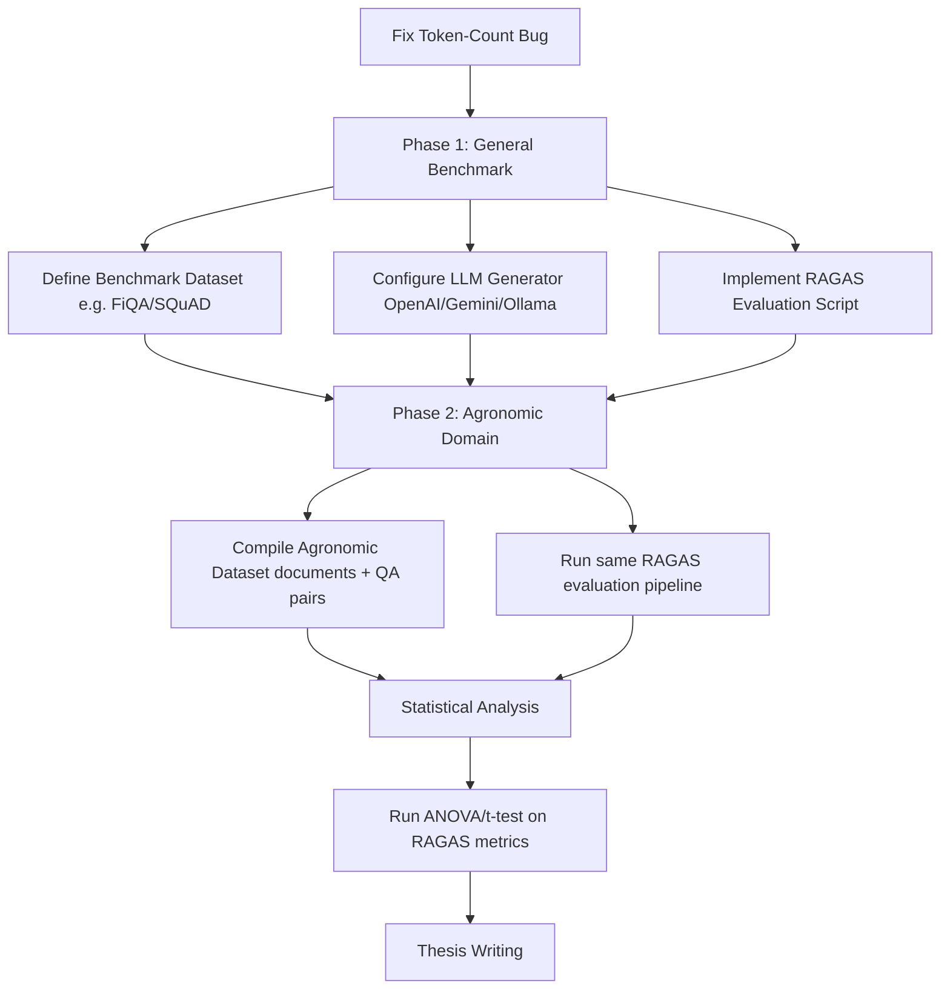

# Análise de Progresso e Próximos Passos do TCC

Esta análise avalia a conformidade do código presente no repositório com a proposta metodológica descrita em [Murillo Ferraz - Projeto de TCC.pdf](file:///c:/Faculdade/TCC/Murillo%20Ferraz%20-%20Projeto%20de%20TCC.pdf).

---

## 📊 Diagnóstico do Estado Atual

O repositório possui uma base sólida para a execução dos experimentos, com o ambiente virtual estruturado e as três técnicas básicas de segmentação de texto (chunking) já codificadas. 

### 1. O que já está implementado
* **Estrutura dos Chunkers**: As três classes de segmentação foram modularizadas de forma limpa:
  * [fixed_size_chunker.py](file:///c:/Faculdade/TCC/fixed_size_chunker.py): Implementa a divisão estática por tamanho de caracteres usando `CharacterTextSplitter`.
  * [recursive_chunker.py](file:///c:/Faculdade/TCC/recursive_chunker.py): Implementa a divisão hierárquica por caracteres usando `RecursiveCharacterTextSplitter`.
  * [semantic_chunker.py](file:///c:/Faculdade/TCC/semantic_chunker.py): Implementa a divisão semântica por limiar de similaridade de cosseno calculada sobre embeddings de sentenças vizinhas (`sentence-transformers/all-MiniLM-L6-v2`).
* **Script de Pipeline de Teste**: O arquivo [pipeline.py](file:///c:/Faculdade/TCC/pipeline.py) carrega o arquivo [texto_exemplo.txt](file:///c:/Faculdade/TCC/texto_exemplo.txt), realiza a divisão do texto, indexa os chunks em coleções in-memory separadas no ChromaDB e testa a recuperação para a query de teste sobre ferrugem na soja.

### 2. Análise do Teste de Execução
Ao executar o pipeline, os resultados mostraram a validação direta da hipótese do seu TCC:
* **Fixed-size**: Cortou conceitos ao meio, resultando em frases incompletas (`or controlada adequadamente...` e `...sem plan`).
* **Recursive**: Dividiu o contexto em blocos e, na busca vetorial, acabou recuperando o Chunk 1 (introdução geral sobre a soja/ferrugem) em vez do Chunk 2, que continha a resposta real sobre o funcionamento do "vazio sanitário".
* **Semantic**: Conseguiu agrupar organicamente a introdução da ferrugem, a menção ao vazio sanitário e seu funcionamento em um único bloco semântico coeso. A busca vetorial recuperou o bloco completo contendo a resposta exata.

---

## 🔍 Discrepâncias Técnicas Identificadas

Para garantir o rigor metodológico exigido pela banca do TCC, as seguintes inconsistências entre o código e o texto da proposta precisam ser corrigidas:

> [!WARNING]
> **Contagem de Tokens vs. Contagem de Caracteres**
> * **O que diz o PDF (Seção 4.5.2)**: A estratégia *Recursive Character Text Splitting* deve ter um *"chunk size alvo de 512 tokens"*.
> * **O que está no código**: Em [recursive_chunker.py](file:///c:/Faculdade/TCC/recursive_chunker.py), o parâmetro está definido como `chunk_size=400` e a função de comprimento é `len` (que conta **caracteres**, não tokens). No processamento de LLMs, 512 tokens equivalem a aproximadamente 2000-2500 caracteres em português. Ao usar 400 caracteres, o chunker está gerando blocos cerca de 5 a 6 vezes menores do que o planejado.
> * **Correção Necessária**: Ajustar o splitter para contar tokens usando um codificador de tokens (como `tiktoken` ou o próprio tokenizer do modelo usado) ou ajustar o tamanho do caractere para refletir a equivalência (ex: `chunk_size` de ~2000 caracteres, ou instanciar usando `RecursiveCharacterTextSplitter.from_tiktoken_encoder`).

> [!NOTE]
> **Parâmetros de Overlap e Testes Preliminares**
> * **O que diz o PDF (Seção 4.5.1)**: O tamanho de janela e overlap da segmentação *Fixed-size* serão definidos a partir de testes preliminares.
> * **O que está no código**: Os valores estão estáticos (`chunk_size=300` e `chunk_overlap=30` caracteres). É recomendável estruturar um script de parametrização para testar diferentes intervalos (ex: 200, 500, 1000 caracteres com overlaps de 10% e 20%).

---

## 🛠️ O que Falta Fazer (Lacunas do Cronograma)

De acordo com o cronograma de execução (Tabela 1, Atividades 4 a 8), o repositório ainda não possui a estrutura para realizar a avaliação automatizada em larga escala. Abaixo estão listadas as implementações necessárias:

### 1. Integração com um Gerador LLM no Pipeline
Para avaliar a geração do RAG com as métricas do RAGAS (*Faithfulness* e *Answer Relevance*), é preciso gerar as respostas do sistema a partir do contexto recuperado.
* **O que falta**: O script [pipeline.py](file:///c:/Faculdade/TCC/pipeline.py) realiza apenas a etapa de **retrapagem (Retrieval)**. Falta integrar um modelo de linguagem (LLM) que receba a query e o contexto recuperado e gere a resposta final.
* **Recomendação**: Utilizar APIs de acesso facilitado (como OpenAI via `langchain-openai`, Gemini via `langchain-google-genai`) ou modelos locais leves (como Llama-3 ou Mistral rodando no Windows via Ollama/ChromaDB).

### 2. Implementação da Fase 1: Benchmark Geral (Atividade 4 e 5)
* **Dataset de Validação**: Falta baixar e configurar um dataset público para a primeira fase de testes (geral). Uma boa opção é usar um subconjunto do **FiQA** ou do **SQuAD**, que contêm os campos necessários: `question`, `contexts` (opcional/recuperado) e `ground_truth`.
* **Script de Execução RAGAS**: Criar um arquivo `run_evaluation.py` que leia o dataset do benchmark, execute o pipeline RAG sob as três estratégias de chunking e salve os resultados calculados pelo framework RAGAS (gerando tabelas comparativas).

### 3. Implementação da Fase 2: Benchmark Agronômico (Atividade 6 e 7)
* **Construção da Base de Dados**: É preciso compilar os documentos PDF/TXT de domínio agronômico (como manuais da Embrapa, artigos técnicos de fitopatologia) em uma pasta `/data/agronomy/documents`.
* **Análise e Anotação**: Criar um arquivo JSON `/data/agronomy/qa_dataset.json` contendo um conjunto de perguntas do domínio (ex: 30 a 50 perguntas) e suas respectivas respostas de referência (*ground_truth*) escritas por você (ou baseadas nos manuais).
* **Execução**: Rodar o mesmo script de avaliação (`run_evaluation.py`) apontando para a base agronômica.

### 4. Análise Estatística (Atividade 8)
* **O que falta**: Um script para processar o output do RAGAS e gerar gráficos comparativos (boxplot de desempenho por métrica) e testes de significância estatística (ex: teste t de Student ou ANOVA no Python com `scipy.stats`) para provar se a diferença de performance entre os chunkers é estatisticamente significante.

---

## 🚀 Como Continuar: Plano de Ação Recomendado

Para estruturar a continuidade do seu trabalho, sugiro a seguinte ordem de passos práticos:

### Passo 1: Correção e Uniformização dos Chunks
1. Ajustar o splitter em [recursive_chunker.py](file:///c:/Faculdade/TCC/recursive_chunker.py) para que utilize tokens em vez de caracteres simples se o tamanho alvo de 512 for de fato em tokens. Podemos usar a classe `RecursiveCharacterTextSplitter.from_tiktoken_encoder`.
2. Criar uma variável global de configuração (ex: `config.json`) para definir os parâmetros experimentais de forma centralizada (`chunk_size`, `overlap`, `percentile_threshold`).

### Passo 2: Implementar o Módulo de Avaliação Geral (Fase 1)
1. Criar um script `evaluation.py` responsável por:
   * Integrar um LLM gerador.
   * Carregar um dataset público leve (ex: o dataset de teste FiQA que vem integrado no HuggingFace Datasets).
   * Rodar as três estratégias de chunking e indexá-las.
   * Recuperar contextos e gerar respostas usando o LLM.
   * Chamar as funções de avaliação do RAGAS para calcular as métricas.
   * Exportar um relatório final em CSV/Excel com as notas de cada query.

### Passo 3: Montar o Dataset Agronômico (Fase 2)
1. Criar a estrutura de diretórios `/data/agronomico/documentos` e colocar textos de referência.
2. Criar um arquivo estruturado de Perguntas e Respostas (`perguntas_agronomia.json`) com 30-50 amostras do domínio.
3. Rodar o pipeline de avaliação (`evaluation.py`) com esses dados e extrair os resultados finais.

### Passo 4: Script de Estatística e Plots
1. Criar um script Jupyter Notebook ou Python simples (`generate_plots.py`) usando `pandas`, `matplotlib`/`seaborn` e `scipy.stats` para plotar boxplots das métricas do RAGAS para as 3 técnicas e computar o p-valor das diferenças observadas.
