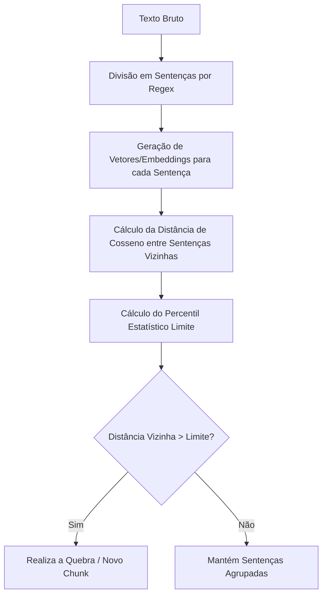

# Estratégias de Chunking no Pipeline RAG: Fundamentação e Implementação

Este documento apresenta a fundamentação teórica e o código de implementação das três técnicas de segmentação de texto (chunking) utilizadas no delineamento experimental do seu Trabalho de Conclusão de Curso (TCC).

---

## 1. Fixed-size Chunking (Tamanho Fixo por Caracteres)

### 📘 Explicação Teórica
A segmentação de tamanho fixo divide o documento original em blocos com um número estrito e pré-determinado de caracteres (ou tokens), permitindo opcionalmente uma sobreposição (*overlap*) de caracteres entre blocos adjacentes.

* **Janela Estática**: O tamanho do bloco permanece inalterado ao longo de todo o documento.
* **Overlap (Sobreposição)**: Mantém uma porção final do bloco $N$ no início do bloco $N+1$. Isso serve para tentar preservar alguma continuidade de contexto nas fronteiras artificiais de divisão.

#### Vantagens
* **Simplicidade**: É extremamente simples e rápida de computar.
* **Previsibilidade**: Garante uniformidade exata de tamanho de chunk para o modelo de embeddings.

#### Desvantagens e Limitações
* **Perda Semântica**: Sendo cega à pontuação, estrutura de parágrafos ou lógica de sentenças, ela frequentemente corta palavras pela metade ou separa ideias correlacionadas (como sujeito e predicado), gerando contextos ruidosos para o LLM.

### 💻 Código de Implementação
Arquivo: **[fixed_size_chunker.py](file:///c:/Faculdade/TCC/fixed_size_chunker.py)**

```python
import tiktoken
from typing import Any
from langchain_text_splitters import CharacterTextSplitter

class MeuFixedSizeChunkerTCC(CharacterTextSplitter):
    """
    Subclasse customizada para o TCC que encapsula o splitter de tamanho fixo,
    medindo o tamanho do chunk em tokens (via tiktoken).
    """
    def __init__(self, chunk_size: int = 512, chunk_overlap: int = 51, encoding_name: str = "cl100k_base", **kwargs: Any):
        self.tokenizer = tiktoken.get_encoding(encoding_name)
        
        super().__init__(
            separator="",
            chunk_size=chunk_size,
            chunk_overlap=chunk_overlap,
            length_function=self._token_length,
            **kwargs
        )

    def _token_length(self, text: str) -> int:
        return len(self.tokenizer.encode(text))
```

---

## 2. Recursive Character Text Splitting (Divisão Recursiva)

### 📘 Explicação Teórica
A divisão recursiva baseia-se em regras gramaticais e de formatação estrutural do próprio texto. Em vez de quebrar de forma fixa, ela percorre uma lista ordenada de separadores de forma hierárquica (do maior para o menor nível estrutural) para tentar manter blocos semânticos e frasais coesos.

#### Ordem Hierárquica Padrão
1. `"\n\n"` (Parágrafos completos)
2. `"\n"` (Quebras de linha)
3. `"."` (Fim de sentenças)
4. `" "` (Espaços/Palavras)

O algoritmo analisa o texto e tenta dividi-lo primeiro nos maiores separadores (`\n\n`). Se o bloco resultante for menor que o limite configurado (`chunk_size`), ele mantém o bloco intacto. Se o bloco exceder o limite, ele divide recursivamente usando o próximo caractere da lista (`\n`, depois `.`, etc.) até atingir a granularidade ideal sem violar o limite máximo.

#### Vantagens
* **Coesão Natural**: Mantém parágrafos inteiros ou frases completas no mesmo bloco sempre que possível.
* **Linguisticamente Sensível**: Respeita a estrutura natural que o autor deu ao documento técnico.

#### Desvantagens e Limitações
* **Sensibilidade à Limitação de Caracteres**: Embora respeite os separadores, a divisão ainda é forçada pela meta de caracteres fixa, o que pode agrupar sentenças semanticamente distintas caso caibam no tamanho do bloco, ou separar ideias afins caso extrapolem o tamanho.

### 💻 Código de Implementação
Arquivo: **[recursive_chunker.py](file:///c:/Faculdade/TCC/recursive_chunker.py)**

```python
import tiktoken
from typing import Any
from langchain_text_splitters import RecursiveCharacterTextSplitter

class MeuRecursiveChunkerTCC(RecursiveCharacterTextSplitter):
    """
    Subclasse customizada para o TCC que encapsula o splitter recursivo,
    medindo o tamanho do chunk em tokens (via tiktoken).
    """
    def __init__(self, chunk_size: int = 512, chunk_overlap: int = 51, encoding_name: str = "cl100k_base", **kwargs: Any):
        self.tokenizer = tiktoken.get_encoding(encoding_name)
        
        super().__init__(
            separators=["\n\n", "\n", ".", " "],
            chunk_size=chunk_size,
            chunk_overlap=chunk_overlap,
            length_function=self._token_length,
            **kwargs
        )

    def _token_length(self, text: str) -> int:
        return len(self.tokenizer.encode(text))
```

---

## 3. Semantic Chunking (Segmentação Semântica por Embeddings)

### 📘 Explicação Teórica
A segmentação semântica baseada em embeddings desvincula a divisão do tamanho físico do texto (caracteres) e foca puramente no significado lógico do texto.



#### Passos do Algoritmo
1. **Sentenciação**: O texto bruto é dividido em sentenças individuais usando expressões regulares (ex: pontuações como `.`, `!` ou `?` seguidos de espaço).
2. **Vetorização**: Cada sentença passa por um modelo de embeddings (ex: `sentence-transformers/all-MiniLM-L6-v2`) gerando uma representação vetorial multidimensional $v_i$.
3. **Cálculo de Distância**: Calcula-se a distância de cosseno entre vizinhos consecutivos ($v_i$ e $v_{i+1}$):
   $$\text{Distância de Cosseno} = 1 - \frac{v_i \cdot v_{i+1}}{\|v_i\| \|v_{i+1}\|}$$
   * Uma distância de `0.0` significa sentenças semanticamente idênticas.
   * Uma distância próxima de `1.0` (ou mais) indica mudança brusca de assunto.
4. **Breakpoint Estatístico**: Calcula-se o percentil estatístico limite (ex: Percentil 70) sobre a lista de distâncias calculadas.
5. **Agrupamento**: As frases sequenciais são unidas em um mesmo chunk. Sempre que a distância entre a frase $i$ e $i+1$ for maior que o percentil determinado, realiza-se a quebra e inicia-se um novo bloco de texto.

#### Vantagens
* **Coesão Temática Ótima**: Garante que cada bloco contenha apenas sentenças que compartilhem da mesma proximidade semântica.
* **Isolamento de Conceitos**: Excelente para textos técnicos, impedindo que múltiplos assuntos distintos se misturem em um único vetor.

#### Desvantagens e Limitações
* **Custo Computacional**: Exige chamadas adicionais ao modelo de embeddings para cada frase individualizada antes da geração dos chunks finais.

### 💻 Código de Implementação
Arquivo: **[semantic_chunker.py](file:///c:/Faculdade/TCC/semantic_chunker.py)**

```python
import re
import numpy as np
from typing import List, Any
from langchain_text_splitters import TextSplitter

class MeuSemanticChunkerTCC(TextSplitter):
    """
    Subclasse customizada para o TCC que implementa a divisão semântica baseada em embeddings
    e distância de cosseno entre sentenças vizinhas.
    """
    def __init__(self, embeddings: Any, percentile_threshold: float = 70.0, **kwargs: Any):
        super().__init__(**kwargs)
        self.embeddings = embeddings
        self.percentile_threshold = percentile_threshold

    def split_text(self, text: str) -> List[str]:
        """
        Divide o texto com base no limite estatístico das distâncias semânticas das sentenças.
        """
        if not text or not text.strip():
            return []

        # 1. Dividir em sentenças usando expressões regulares
        sentences = [s.strip() for s in re.split(r'(?<=[.!?])\s+', text) if s.strip()]
        
        if not sentences:
            return []
        if len(sentences) == 1:
            return sentences

        # 2. Gerar embeddings para cada sentença
        embeddings_list = self.embeddings.embed_documents(sentences)
        
        # 3. Calcular a distância de cosseno (1 - cosine_similarity) entre vizinhos
        distances = []
        for i in range(len(embeddings_list) - 1):
            emb1 = np.array(embeddings_list[i])
            emb2 = np.array(embeddings_list[i+1])
            
            norm1 = np.linalg.norm(emb1)
            norm2 = np.linalg.norm(emb2)
            
            if norm1 == 0 or norm2 == 0:
                similarity = 0.0
            else:
                similarity = np.dot(emb1, emb2) / (norm1 * norm2)
            
            similarity = np.clip(similarity, -1.0, 1.0)
            distances.append(1.0 - similarity)

        # 4. Definir ponto de corte com base em percentil estatístico
        threshold = np.percentile(distances, self.percentile_threshold)

        # 5. Agrupar sentenças em blocos baseando-se no breakpoint
        chunks = []
        current_chunk = [sentences[0]]
        
        for i in range(len(distances)):
            if distances[i] > threshold:
                chunks.append(" ".join(current_chunk))
                current_chunk = [sentences[i+1]]
            else:
                current_chunk.append(sentences[i+1])
        
        if current_chunk:
            chunks.append(" ".join(current_chunk))

        return chunks
```

---

## 4. Relevância para o Domínio Agronômico (TCC)
Ao avaliar textos técnicos agrícolas no seu RAG, a segmentação semântica mostra sua força porque previne a fragmentação de instruções agronômicas complexas. Por exemplo, a descrição da ferrugem da soja e a regra temporal de 90 dias do vazio sanitário compartilham forte semelhança semântica de contexto ecológico e fitossanitário. O chunker semântico agrupa essas ideias de forma coesa, permitindo que a resposta final do LLM seja precisa e contextualizada, enquanto métodos estáticos correm o risco de isolar esses fatos em blocos fragmentados.
